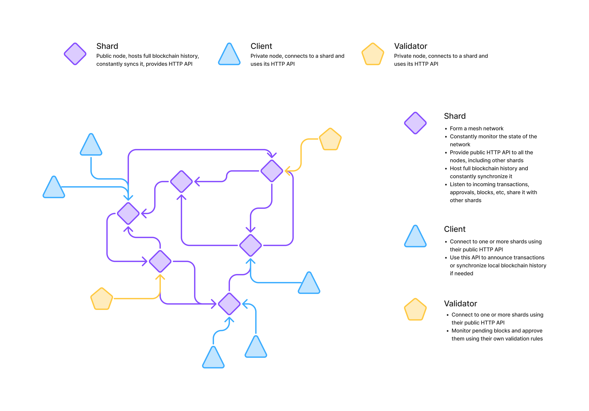

# dwchain - barebone blockchain library

The goal of the project is to provide a way for developers to easily organize
decentralized data storing in organized manner. For example, let's say you want
to make a decentralized chat app. You'd need to implement a mechanism to
synchronize messages between all the users of your chat. This library handles
decentralized networking and organizes data equally to all the users of your
app - in a blockchain. Moreover, users of your app don't need to download this
blockchain, they can connect to public shards and use their HTTP API to fetch
updates for your app.

- Transactions are raw byte slices;
- K-256 curve for signing;
- 3 types of nodes: clients, shards and validators;
- Public HTTP APIs, no need to self-host the blockchain;
- 2/3 of validators must approve new blocks;
- No cryptocurrency.



# HTTP Shards API v1 reference

## Transactions

API to push new transactions to the network and monitor their status.

### `GET /api/v1/transactions`

Get list of all the pending transactions. These are transactions which weren't
yet added to any block.

Return list of hashes of pending transactions.

```ts
type Response = string[];
```

### `PUT /api/v1/transactions`

Announce transaction to the network. This operation will ask network's shard
to store your transaction in its pending transactions pool and share it with
other shards it is connected to. In future your announced transaction can be
validated and added to the blockchain, or, potentially, be removed after some
time. Until transaction is validated you should monitor its status and act
accordingly.

```ts
type Request = object; // Standard transaction JSON format
```

### `GET /api/v1/transactions/<hash>`

Read content of a transaction with provided hash.

If transaction with such hash is not found - then `404` status should be
returned.

```ts
type Response = object; // Standard transaction JSON format
```

## Blocks

API to push new blocks to the network and monitor their status.

### `GET /api/v1/blocks`

Get list of all the pending blocks. These are blocks which weren't yet validated
and fixated in the blockchain.

```ts
type Response = {
    block: string;
    sign: string;
    approvals: string[];
}[];
```

### `PUT /api/v1/blocks`

Announce block to the network. This block will first be added to the pending
blocks pool, and then, if it's valid and enough approvals are available, will
be written to the blockchain and fixated in the history.

```ts
type Request = object; // Standard block JSON format
```

### `GET /api/v1/blocks/<hash>`

Read content of a block with provided hash.

If block with such hash is not found - then `404` status should be returned.

```ts
type Response = object; // Standard block JSON format
```

### `PUT /api/v1/blocks/<hash>`

Announce approval for a block with provided hash.

```ts
type Request = string;
```

## Sync

API to synchronize blocks of the blockchain between the nodes of the network.

### `GET /api/v1/sync[?after=<hash>]`

Get list of some blocks after a block with provided hash. If no `after` param
provided then the first block of the blockchain will be assumed.

Full blocks will be returned so that client can download them and validate
locally.

If selected `after` block is not a part of blockchain known to the shard then
`404` status should be returned.

```ts
type Response = object[]; // Standard block JSON format
```

### `PUT /api/v1/sync`

Announce a part of a blockchain to the network. This part can be verified by the
shard and, if valid, attempted to be written to the history of the shard. If so,
then shard can continue sharing this part of the blockchain.

```ts
type Request = object[]; // Standard block JSON format
```

## Shards

API to handle public nodes (shards) of the network.

TBD

## Validators

API to handle validator nodes of the network.

TBD

Author: [Nikita Podvirnyi](https://github.com/krypt0nn)\
Licensed under [GPL-3.0](LICENSE)
